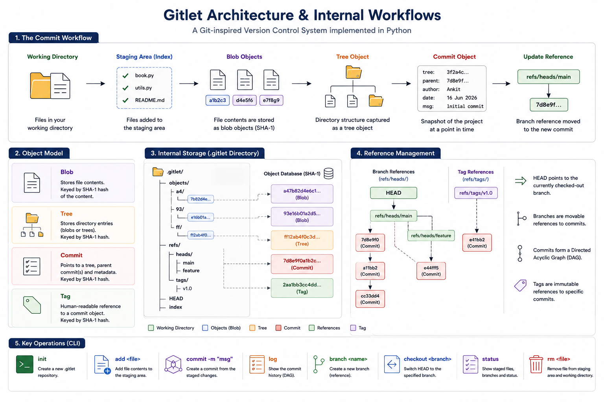

# 🌳 Gitlet


A lightweight Git-inspired version control system implemented in **Python** that recreates Git's core object model and repository internals. Gitlet stores versioned data using content-addressable objects, supports branching and commits, and demonstrates how Git manages repositories under the hood.

---

## ✨ Features

- 📁 Initialize Git repositories
- 📦 Blob, Tree, Commit and Tag objects
- 🔑 SHA-1 content-addressable object storage
- 🗜 Zlib-compressed object database
- 📝 File staging and commits
- 🌿 Branch creation and switching
- ⏪ Checkout previous commits
- 📜 Commit history traversal
- 🔖 Reference management (`HEAD`, branches, tags)
- 💻 Command-line interface

---

## 🛠 Tech Stack

| Category | Technologies |
|----------|--------------|
| Language | Python |
| Object Storage | SHA-1 + Zlib |
| CLI | argparse |
| File System | pathlib, os |
| Serialization | Custom Git object serialization |

---

## 🏗 System Architecture

<p align="center">
  
</p>

---

## 📂 Project Structure

```text
src/
├── commands/        # CLI command implementations
├── objects/         # Blob, Tree, Commit & Tag objects
├── refs.py          # Branch and HEAD reference management
├── repository.py    # Repository creation and management
├── status.py        # Repository status functionality
├── ignore.py        # .gitignore parsing and file filtering
├── utils.py         # Utility functions
├── cli.py           # Command-line interface

libgitlet.py         # Core Git object and repository implementation
gitlet               # Executable entry point

README.md
```

---

## ⚙️ Git Object Model

| Object | Purpose |
|--------|---------|
| **Blob** | Stores file contents |
| **Tree** | Represents directory structures by referencing blobs and other trees |
| **Commit** | Stores a snapshot, metadata, parent commit(s), and root tree |
| **Tag** | References a specific commit with a human-readable name |

---

## 🔑 Object Storage

Each Git object follows Git's content-addressable storage model:

- Serialized into Git's object format
- Hashed using **SHA-1**
- Compressed using **zlib**
- Stored inside `.gitlet/objects/` using its SHA-1 hash

Example:

```text
objects/
├── a4/
│   └── 7b82d4...
├── 93/
│   └── e16b01...
```

---
## 🌿 Branch Management

Gitlet manages repository state using references similar to Git. Branches point to commit objects, while `HEAD` tracks the currently checked-out branch, enabling efficient branching and history traversal.

---

## 🚀 Running Locally

### Clone the repository

```bash
git clone https://github.com/AnkitP1603/Gitlet.git
```

### Initialize a new repository

```bash
python libgitlet.py init
```

### Common Commands

```bash
python libgitlet.py add <file>
python libgitlet.py commit "Initial commit"
python libgitlet.py status
python libgitlet.py log
python libgitlet.py branch feature
python libgitlet.py switch feature
```

> The executable `gitlet` is included in the repository. Alternatively, run commands using `python libgitlet.py`.

---

## 📌 Core Concepts

| Component | Purpose |
|-----------|---------|
| Blob | Stores file contents |
| Tree | Stores directory hierarchy |
| Commit | Snapshot of the repository |
| Tag | Named reference to commits |
| Object Store | Stores compressed Git objects |
| References | Tracks branches and HEAD |
| Index | Staging area before commits |

---

## 🙏 Acknowledgements

This project was inspired by **Write Yourself a Git (wyag)** by Thibault Polge and the official Git documentation.

The tutorial served as a learning resource for understanding Git's internal design. This implementation was developed as an educational project to explore Git's object model, content-addressable storage, commits, trees, references, and repository management.
